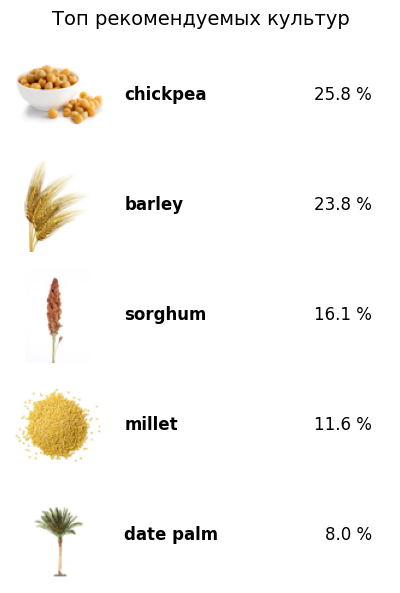

# P2S (Plant2Soil): Система по распознаванию вида почвы по фотографии с рекомендацей наиболее подходящей культуры для посева
## Саммари проекта:
### Бизнес-проблема:
- Посевные площади на фермерских хозяйствах ограничены, цикл произрастания культур долгий и муторный, цена ошибок и проволочек высока
- В зависимости от вида/уровня минерализации/характера происхождения почвы а также от окружающих климатических условий перечень растений и сельхоз культур, которые дали бы хороший, здоровый урожай при заданных услвоиях крайне ограничен
- Таким образом, любому фермеру до ухода с головой в очередной цикл посева желательно иметь на руках тщательный due diligence на предмет того, насколько готова его почва к тем или иным сельхоз культурам

### Актуальность с точки зрения экологии:
- Призыв к более рациональному использование земли и полезных ресурсов (воды для орошения/электричества/удобрений) с actionable планом для оптимизации

### Бизнес-решение:
- Мобильное приложение, которое позволяет создавать и вести виртуальный трекинг посевных площадей, используя разветвленную систему датчиков, камер, измерителей влажности, трекеров УФ-излучения и уровня минерализации почвы итп с нейросеткой под капотом для интеграции данных
- Функциональность: 1) первоначальная оценка почвы на предмет "фита" с сельхоз культурами 2) отслеживание темпов роста растений при помощи фотокамер 3) трекинг болезней по фотографиям 4) оценка урожайности и практические рекомендации по уходу в реальном времени с учетом накопленных в базе знаний кейсов с best practices в сфере фермерства

### Пайплайн работы прототипа
Данный прототип обрисовывает работу приложения на 1) этапе решения бизнес задачи 'первоначальная оценка почвы на предмет "фита" с сельхоз культурами'. Что будет делать прототип:
- Он забирает от пользователя фотографию почвы на которой планируетя начать культивирование. Например:

- По включенной геолокации на основе средних данных по местности или полученных в детальном формате от power-юзеров, которые обладают расширенной информацией о погодных условиях на ферме и техничесмкими знаниями о почве с которой работают, перечень параметров о влажности/температуре/минерализации земли на которой будут планироваться сельхоз работы
- На основе фотографии модель классифицирует вид почвы и соединяет полученную метку с обогащенными датами из пользовательского опросника, после чего у нас на руках имеется полный перечень параметров необходимых для того чтобы подобрать для юзера наиболее подходящие культуры для выращивания
- Выдаем пользователю рекомендации на графике

###  Составляющие части прототипа:
- Дообученная модель для классификации изображений [microsoft/resnet-50](https://huggingface.co/microsoft/resnet-50) на которой прогнали трейн датасет с фотографиям почв размеченных по 7 классам ('Alluvial_Soil', 'Arid_Soil', 'Black_Soil', 'Laterite_Soil', 'Mountain_Soil', 'Red_Soil', 'Yellow_Soil')
- 3 модели CatBoost для выдачи топ k предсказаний наиболее подходящих культур для посева для почвы с заданными характеристиками, которые выбираются в зависимости от полноты пользовательского инпута (например, пользователь не знает детаельной информации о климате в регионе и не дал доступ к геолокации -> берем для рекомендации light модель)
- Слой для отображения топ k рекомендаций на основании фотографии + юзер инпута прогнанного через CatBoost

## Инфорация о датасетах
(1) Датасет содержащий размеченные фотографии видов почв: 1189 наблюдений, 7 классов [Soil-Classification-Dataset
](https://github.com/Phantom-fs/Soil-Classification-Dataset/tree/main)
(2) Синтетически датасет содержащий 1189 наблюдения с климатическими и почвенными характеристиками 

Описание колонок датасета

| Название колонки        | Тип данных        | Физический смысл / примеры значений                     |
|-------------------------|-------------------|----------------------------------------------------------|
| soil_label              | категориальный    | Тип почвы (Alluvial, Black, Red, Arid и др.)             |
| climate_zone            | категориальный    | Климатическая зона региона (Arid, Monsoon, Temperate)    |
| temp_c_mean             | числовой (float)  | Среднегодовая температура, °C (-2 to 40)                 |
| rain_mm_year            | числовой (int)    | Годовое количество осадков, мм/год (50-3000)             |
| rel_humidity_pct        | числовой (int)    | Средняя относительная влажность воздуха, % (15-95)       |
| ph                      | числовой (float)  | Кислотность почвы, pH (4.5-8.6)                          |
| organic_carbon_pct      | числовой (float)  | Содержание органического углерода в почве, % (0.1-3.5)  |
| n_kg_ha                 | числовой (int)    | Доступный азот, кг/га (20-180)                            |
| p_kg_ha                 | числовой (int)    | Доступный фосфор, кг/га (6-60)                            |
| k_kg_ha                 | числовой (int)    | Доступный калий, кг/га (30-450)                           |
| cec_cmol_kg             | числовой (float)  | Ёмкость катионного обмена, cmol(+)/kg (3-45)             |
| ec_ds_m                 | числовой (float)  | Электропроводность почвы, индикатор засоления, dS/m      |
| soil_moisture_pct       | числовой (float)  | Содержание влаги в почве, % (6-40)                        |
| sand_pct                | числовой (float)  | Доля песка в почве, % (20-70)                             |
| silt_pct                | числовой (float)  | Доля ила в почве, % (10-55)                               |
| clay_pct                | числовой (float)  | Доля глины в почве, % (10-60)                             |
| recommended_crop        | категориальный    | Рекомендуемая культура для посадки, таргет модели        |

## Модель для классификации изображения:
- Дообученная модель для классификации изображений [microsoft/resnet-50](https://huggingface.co/microsoft/resnet-50) на которой прогнали трейн датасет с фотографиям почв размеченных по 7 классам ('Alluvial_Soil', 'Arid_Soil', 'Black_Soil', 'Laterite_Soil', 'Mountain_Soil', 'Red_Soil', 'Yellow_Soil')
- Дообучение проводилось с гиперметрами 15 epoch и 32 batch на 80% фотографий (20% осталось для тестирования)

## Схема работы классификатора подходящих посевных культур для заданных пользователям инпутах
- Метку класса определенную по фотографии ('Alluvial_Soil', 'Arid_Soil', 'Black_Soil', 'Laterite_Soil', 'Mountain_Soil', 'Red_Soil', 'Yellow_Soil') обогощаем инфой из пользовательского опросника, который предлагается пройти каждому пользователю Plant2Soil
- Пользователь может указать данные в трех конфигурация: 1) Базовый минимум (фото + вид климата) 2) Продвинутый оптимум (то же + подробная инфа про осадки/температуре в регионе) 3) Роскошный максимум (то же + подробная инфа про насыщенности почвы минералами/композиции почвы)

m1_params = ['soil_label', 'climate_zone']

m2_params = ['soil_label', 'climate_zone', 'temp_c_mean', 'rain_mm_year',
       'rel_humidity_pct']

m3_params = ['soil_label', 'climate_zone', 'temp_c_mean', 'rain_mm_year',
       'rel_humidity_pct','ph', 'organic_carbon_pct', 'n_kg_ha', 'p_kg_ha',
       'k_kg_ha', 'cec_cmol_kg', 'ec_ds_m', 'soil_moisture_pct', 'sand_pct',
       'silt_pct', 'clay_pct']
       
- В соответствии с параметрами mi_params, подбираем одну из m1/m2/m3 - CatBoost классификатор, который был обучен на соотвествующем перечне колонок из синтетического датасета
- В качестве инпута от пользователя модель принимает именованные параметры mi_params
- В качестве output классификатор на выбор отдает одно предсказание recommended_crop или топ k самых достоверных предсказаний классификатора по вероятности
